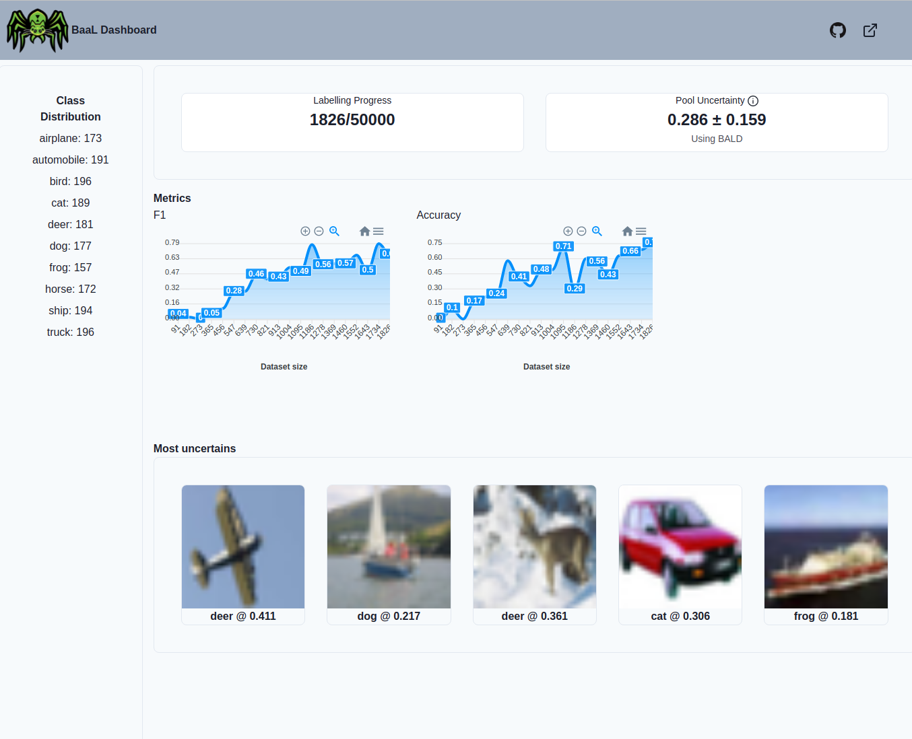

# **WIP** A Dashbord for Active learning 

This project aims at creating an interactive dashboard for [BaaL](https://github.com/ElementAI/baal), an active learning library. 

**WARNING** I have little knowledge in React/Frontend development.

### How to run

1. `docker-compose up --build`
2. Go to `localhost:3000`

Example

## TODO (Contributions welcomed)

1. Complete active learning loop
2. ~~Add types to FastAPI~~
3. ~~Improve app styling~~
4. Add unit tests
5. End to end example for CV.
6. End to end example for NLP.

# Components

1. Labelling progress
   1. How many items are labelled versus how many left.
   2. What is the average uncertainty of your dataset. When the standard deviation is low, it might be time to stop.
2. Metrics
    1. Show metrics at different time of labelling. When the metrics do not improve anymore, we can stop labelling.
3. Most uncertain examples
    1. Show the top-5 along with their predictions.
4. Class distribution
    1. Show the current class distribution.

## Future components/ideas
1. Show class distribution over time.
2. Differentiate between data uncertainty and model uncertainty to find out of distribution examples.
3. Warnings when we have reached a plateau in most metrics or in mean uncertainty.
4. Provide dataset complexity and class confusion.

# Resources

* Check out the [post](https://testdriven.io/blog/fastapi-react/).
* Check out the [theme](https://demos.creative-tim.com/docs-purity-ui-dashboard)